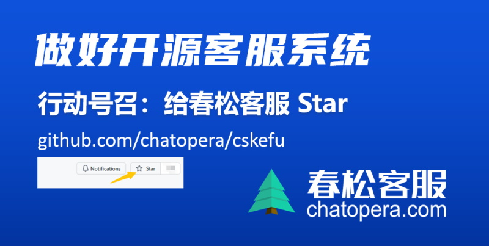

# 春松客服大讲堂

😉 春松客服大讲堂，面向开发者、软件工程师及运维人员的在线课程。

* 基于春松客服定制客服系统，紧紧围绕春松客服开发技能
* 由浅入深的介绍春松客服上线智能客服系统、运营客服工作
* 全面介绍春松客服插件、机器人客服的等原理和使用

## 春松客服大讲堂 2019

详细介绍 & 课程 PPTs：[春松客服大讲堂_2019/README.md](./春松客服大讲堂_2019)

## 春松客服

[https://www.cskefu.com](https://www.cskefu.com/)

:evergreen_tree: 春松客服是 [Chatopera](https://www.chatopera.com/) 发布的开源并且免费的智能客服系统 / CSKeFu is a Customer Support System for Enterprises in a High Performance Low-Touch way, OpenSource and Free for the world by [Chatopera](https://www.chatopera.com/).

[给春松客服点赞](https://github.com/chatopera/cskefu/stargazers)

## 鸣谢

[IBM Cloud 赞助春松客服服务器资源 12W US Dollar（2019 年度）](https://cloud.ibm.com/)

[Amazon AWS 赞助春松客服服务器资源 5W RMB（2021 年度）](https://aws.amazon.com)

## 开源许可协议

Copyright (2018-2021) <a href="https://www.chatopera.com/" target="_blank">北京华夏春松科技有限公司</a>

